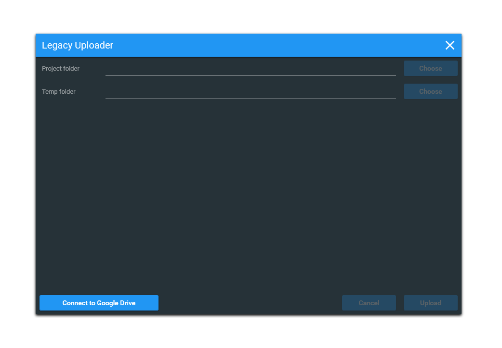

# Legacy Uploader
A tool used to upload game files for the [Legacy Manager](https://github.com/CiriousJoker/LegacyManager).

## Screenshot

## Installation

This software itself requires no installation and you can [click here](https://github.com/CiriousJoker/LegacyManager/releases/latest) to get the latest release here on Github.

## Usage

1. Connect to Google Drive
2. Select the project/game folder and a temporary folder
3. Click [Upload]
4. Choose a password (only the first time) and a game name

After the files have been compressed, encrypted and uploaded, you'll get a URL that points to the uploaded game file. Copy this url into the database that the [Legacy Manager](https://github.com/CiriousJoker/LegacyManager) downloads and add the additional information you want to include.

## Legal

This sourcecode is licensed under the [MIT license](LICENSE).